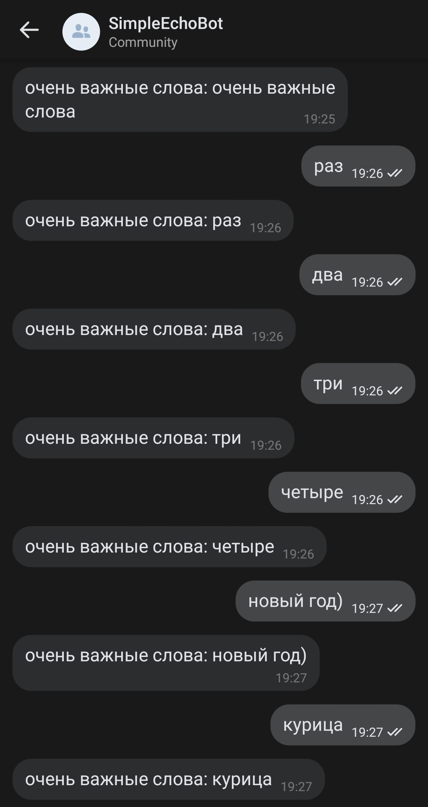

# VK Echo Bot

Простой бот, цитирующий присланный ему текст

## Запуск

Чтобы поднять бота, необходимо:
* создать VK сообщество с разрешением на сообщения
* получить в разделе **Работа с API** токен доступа (*access-token*)
* поднять сервер и вставить его URL в соответствующее поле в разделе Callback API
* указать версию API (*version*) и секретный ключ (*secret*) в том же разделе

Чтобы сервер мог получать уведомления от API, необходимо подтвердить
его с помощью кнопки **Confirm**. Прежде чем это сделать, нужно указать
в файле конфигурации строку, которую должен вернуть сервер (*confirmation*) и
запустить [VKBotApplication](src/main/kotlin/zhukovskii/justai/vkbot/VKBotApplication.kt)

Все слова, выделенные курсивом, являются необходимыми
параметрами конфигурации. Их нужно указать в файле [application.properties](src/main/resources/application.properties)

После того, как все параметры конфигурации указаны и приложение запущено, следует нажать
на кнопку **Confirm**. Должно появиться уведомление об успешном подтверждении сервера

Готово, можно вести с ботом содержательную беседу:

